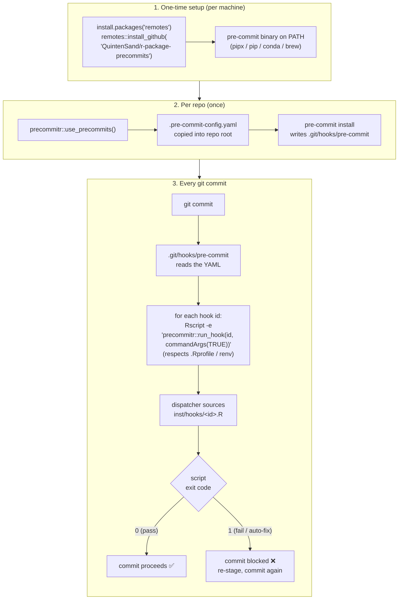

# precommitr

> Shared pre-commit hooks for R analysts. One install, one command, every repo
> — **and zero network access at hook time**.

`precommitr` is a tiny R package that bundles **one** opinionated
`.pre-commit-config.yaml` and exposes **one** function to drop it into any of
your repos and activate the git hooks. Every hook is `repo: local` and runs
through `precommitr::run_hook()`, which means pre-commit never has to clone
external hook repos from GitHub — once `precommitr` is installed in R, the
hooks work fully **offline**. Ideal for analyst VMs where outbound network
access is whitelisted.

---

## How it works



The single source of truth is the YAML in `inst/templates/` **plus** the
scripts in `inst/hooks/<id>.R`. To roll out a change org-wide, edit one of
those, bump the package version, ask the team to upgrade.

### Org-wide update lifecycle

```mermaid
sequenceDiagram
    autonumber
    actor Maintainer
    participant Repo as precommitr repo
    actor Analyst
    participant Hook as pre-commit on commit

    Maintainer->>Repo: Edit inst/hooks/&lt;id&gt;.R or YAML
    Maintainer->>Repo: Bump Version in DESCRIPTION
    Maintainer->>Repo: git push
    Analyst->>Repo: remotes::install_github(...)
    Analyst->>Analyst: precommitr::update_config()
    Note over Analyst: latest YAML now in the repo
    Analyst->>Hook: git commit
    Hook->>Hook: runs updated inst/hooks/&lt;id&gt;.R
```

---

## One-time setup (per analyst, per machine)

```r
# 1. Install the wrapper package — from GitHub, or from your internal mirror
install.packages("remotes")
remotes::install_github("QuintenSand/r-package-precommits", ref = "development")
#   ...or, if your org has a CRAN-like mirror:
# install.packages("precommitr", repos = "https://your.internal/mirror")

# 2. Make sure the 'pre-commit' binary is on PATH:
precommitr::install_precommit()
# If you have no internet, do one of:
#   pip install --user pre-commit
#   pipx install pre-commit
#   conda install -c conda-forge pre-commit
```

### Note on `renv`

Hooks are invoked with plain `Rscript`, so the project's `.Rprofile` runs
normally — which means `renv` auto-activates when present. The hook then uses
whichever library `.libPaths()` resolves to.

**If your project uses `renv`** (the common pattern on analyst VMs), install
`precommitr` into the project library and snapshot it:

```r
renv::install("QuintenSand/r-package-precommits")
renv::snapshot()
```

That puts `precommitr` in `renv/library/` and records it in `renv.lock`, so
the hook will find it. Repeat this in each repo, or use
`renv::settings$external.libraries()` to share one install across projects.

**If your project doesn't use `renv`**, install `precommitr` to your user
library and the hook will pick it up:

```r
remotes::install_github("QuintenSand/r-package-precommits")
.libPaths()[length(.libPaths())]   # where it landed
```

---

## Per-repo setup (every new project)

```r
# from the repo's working directory
precommitr::use_precommits()
```

That single line:

1. Copies the shared `.pre-commit-config.yaml` into the repo root.
2. Runs `pre-commit install` so the hooks fire on every `git commit`.

From now on, every commit in that repo is checked. If a hook fails (e.g. a
file isn't styled), the commit is blocked, the hook fixes the file, and the
analyst just `git add`s the fix and commits again.

---

## Updating the org config

When you want everyone to pick up a new version of the hooks:

1. Edit `inst/templates/pre-commit-config.yaml` and/or the relevant script
   under `inst/hooks/<id>.R`.
2. Bump the `Version:` in `DESCRIPTION`.
3. Merge into `main` (or `development`).
4. Tell analysts:

   ```r
   remotes::install_github("QuintenSand/r-package-precommits")
   precommitr::update_config()   # re-copies the YAML
   ```

Because all hooks are `repo: local`, there's nothing to `pre-commit
autoupdate` — the R package upgrade *is* the update.

---

## What's in the shared config

All hooks are dispatched via `precommitr::run_hook("<id>", ...)`:

| Hook id                     | What it does                                          |
| --------------------------- | ----------------------------------------------------- |
| `parsable-R`                | Fails if any `.R` file can't be parsed                |
| `style-files`               | Auto-formats R / Rmd / qmd with **styler** (tidyverse)|
| `lintr`                     | Runs **lintr** (warn-only, never blocks commits)      |
| `no-browser-statement`      | Blocks leftover `browser()` calls (AST-based)         |
| `no-debug-statement`        | Blocks leftover `debug()` / `debugonce()` calls       |
| `no-print-statement`        | (optional) Blocks `print()` outside tests/inst/vignettes |
| `trailing-whitespace`       | Strips trailing whitespace                            |
| `end-of-file-fixer`         | Ensures every file ends with exactly one LF           |
| `mixed-line-ending`         | Normalises line endings to LF                         |
| `check-merge-conflict`      | Catches leftover `<<<<<<<` markers                    |
| `check-yaml`                | Validates YAML files (needs `yaml` package)           |
| `check-added-large-files`   | Blocks accidental commits of files > 2 MB             |

`styler`, `lintr` and `yaml` are listed in `Suggests`, not `Imports` — install
them only if you want the corresponding hooks to do anything.

---

## Function reference

| Function                          | What it does                                       |
| --------------------------------- | -------------------------------------------------- |
| `install_precommit()`             | One-time install of the `pre-commit` binary        |
| `use_precommits()`                | Drop the shared config + activate hooks in a repo  |
| `update_config()`                 | Re-copy the latest shared config into a repo       |
| `check_precommit_install()`       | Is the `pre-commit` executable on PATH?            |
| `run_hook(id, files)`             | (Internal) hook dispatcher invoked by pre-commit   |

---

## FAQ

**Q: How does the styler hook actually behave on commit?**
It just runs styler and re-stages the result. Concretely:

1. You stage R / Rmd / qmd files and `git commit`.
2. The hook spawns a fresh `Rscript` subprocess which calls
   `styler::style_file()` on each file (tidyverse style). The
   subprocess approach exists because `styler::style_file()` fails
   silently with `object 'terminal' not found` when called from inside
   the hook dispatcher's evaluation environment — see the
   Troubleshooting section below.
3. styler edits the files in place.
4. The hook runs `git add` on those files so the styled version is
   what ends up in the commit.
5. The hook exits 0 — the commit goes through in one shot.

If you'd rather review styler's changes before they land (the standard
pre-commit "fix → fail → re-stage" pattern), edit
`inst/hooks/style-files.R` to compare before/after and exit 1 when
anything was modified. Earlier versions of `precommitr` shipped that
behaviour and the git history has the previous script.

**Q: Does lintr auto-fix issues?**
No. `lintr` is a static analyzer, not a rewriter — there is no
`lintr::fix()` in the R ecosystem, the way `ruff --fix` or
`eslint --fix` work in other languages. The hook is intentionally
warn-only: it prints findings (visible because the hook has
`verbose: true`) but never blocks the commit. styler covers most
*stylistic* issues lintr would flag (spacing, indentation, `=` vs
`<-`, quote style, trailing whitespace); lintr is there for the
semantic stuff styler can't touch (`object_name_linter`,
`cyclocomp_linter`, undefined-variable detection, etc.) and you fix
those by hand.

**Q: Our VM can't reach github.com. Does this still work?**
Yes — that's the whole point. The bundled config uses `repo: local` exclusively
and dispatches every hook through `precommitr`, which is already installed
locally. Once `precommitr` and the `pre-commit` binary are on the VM, the
hooks need zero network access.

**Q: Our internal mirror doesn't have the `styler` / `lintr` / `yaml`
packages. Will `precommitr` still install?**
Yes — those are in `Suggests`, so the package installs without them. The
corresponding hooks will print a friendly "please install X" message and (for
`styler`) fail the commit until installed, or (for `lintr`/`yaml`) skip
silently.

**Q: Can analysts override hooks locally?**
Yes — they can edit the local `.pre-commit-config.yaml`, but the next
`update_config()` will overwrite it. Discourage per-repo drift; raise an
issue on this repo instead so the change gets picked up org-wide.

**Q: What if a hook is too strict on an existing codebase?**
Open a PR on this repo to relax the hook (edit the script in
`inst/hooks/<id>.R` or the YAML defaults). Don't fork the config per repo.

---

## Troubleshooting

### `Error in loadNamespace(x) : there is no package called 'precommitr'`

The hook ran but can't find the package. Two common causes:

- You installed `precommitr` inside an renv-activated session but the
  hook is running outside renv (or vice versa). The hook respects
  `.Rprofile`, so renv activates if the project has it. Make sure
  `precommitr` is in the library `.libPaths()` resolves to *for the
  same R that runs the hook*. Test with:
  ```bash
  Rscript -e '"precommitr" %in% rownames(installed.packages())'
  ```
- You upgraded `precommitr` but didn't restart R. R caches loaded
  namespaces for the whole session — even after `renv::install()`
  rebuilds on disk, the in-memory `precommitr` is the old one until
  you restart. `Ctrl+Shift+F10` in RStudio.

### `update_config()` doesn't change `.pre-commit-config.yaml`

Same restart issue as above — `update_config()` lives in the cached
in-memory `precommitr`, and reads its bundled template from the *cached*
package install. Restart R after `renv::install()`, then call
`update_config()` again.

### styler reports "Passed" but the file isn't actually styled

If the verbose output shows styler ran on the file but no lines
changed, and you can prove styler should have changed them
(`Rscript -e 'styler::style_file("test_file.R")'` *does* edit the file),
you may be hitting the depth-sensitive `object 'terminal' not found`
NSE bug in styler 1.11. precommitr works around this by running styler
in a fresh Rscript subprocess; that workaround is already in place as
of v1.0.0. If you see this symptom on a newer styler version, the
workaround can be removed — open an issue.
